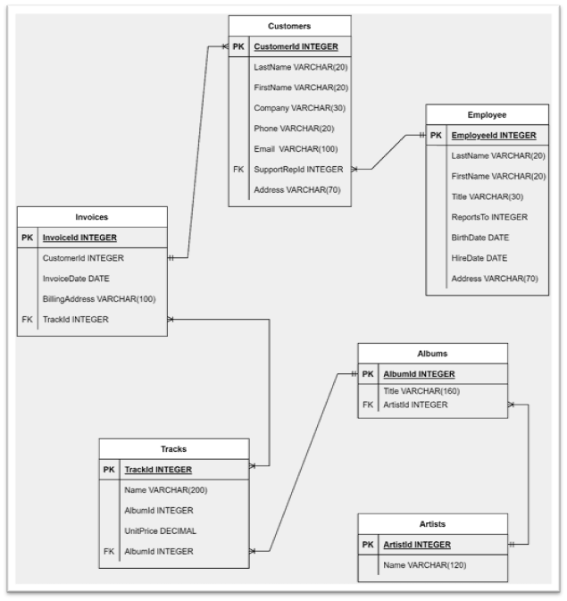
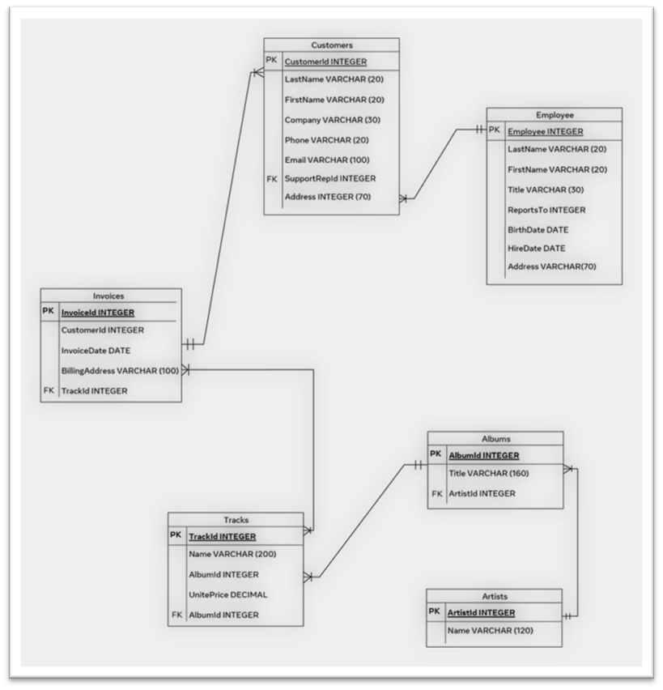

# Database Schema Design – Chinook Example

## Task 1: Database Purpose
The Chinook database represents a digital media company.

It stores and manages data related to:
- Employees
- Customers
- Artists
- Albums
- Tracks (songs)
- Invoices (sales)

The goal is to organize and relate this data efficiently using a relational database.

---

## Task 2: Main Tables

### 1. Employees
- Stores employee data
- Primary Key: EmployeeId

### 2. Customers
- Stores customer information
- Primary Key: CustomerId

### 3. Invoices
- Stores purchase transactions
- Primary Key: InvoiceId

### 4. Artists
- Stores artist data
- Primary Key: ArtistId

### 5. Albums
- Stores albums created by artists
- Primary Key: AlbumId

### 6. Tracks
- Stores songs
- Primary Key: TrackId

---

## Task 3: Relationships Between Tables

- One Employee → Many Customers  
- One Customer → Many Invoices  
- One Invoice → One Track  
- One Artist → Many Albums  
- One Album → Many Tracks  
- One Track → One Album  

---

## Task 4: Entity Relationship Diagram

The schema connects tables using foreign keys:

- Customer.SupportRepId → Employee.EmployeeId  
- Invoice.CustomerId → Customer.CustomerId  
- Album.ArtistId → Artist.ArtistId  
- Track.AlbumId → Album.AlbumId  

Refer to the diagram below:

---

## Optional Task: Extended Schema

### New Table: Location
- Stores artist location
- Attributes:
  - LocationId (Primary Key)
  - City
  - Country

### Relationship:
- Artist.LocationId → Location.LocationId

Updated schema:

